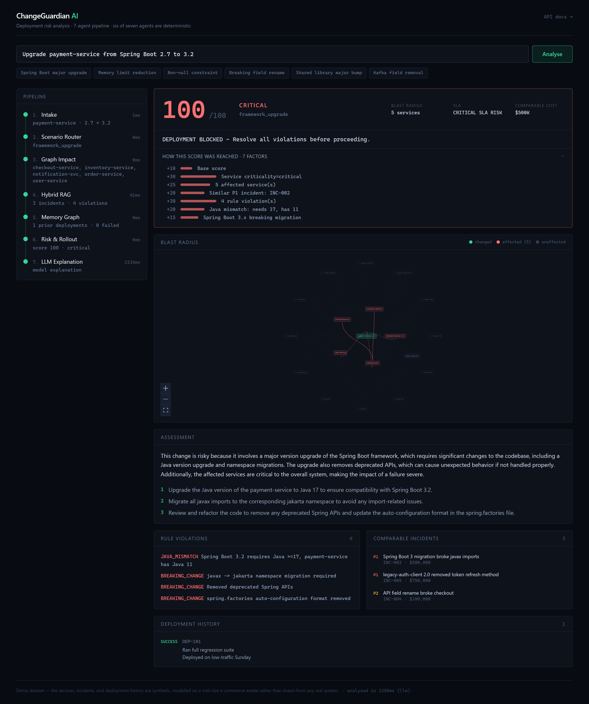
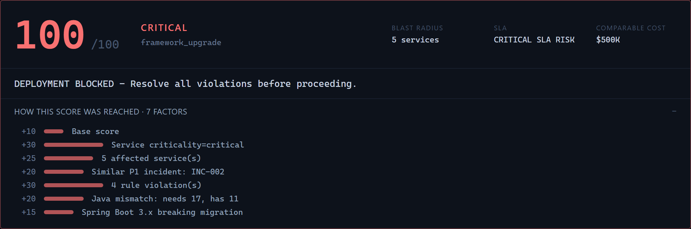
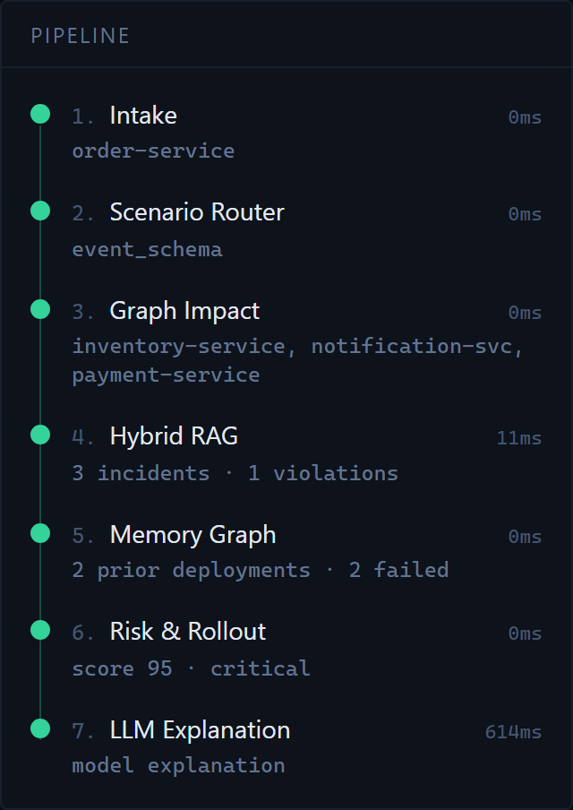
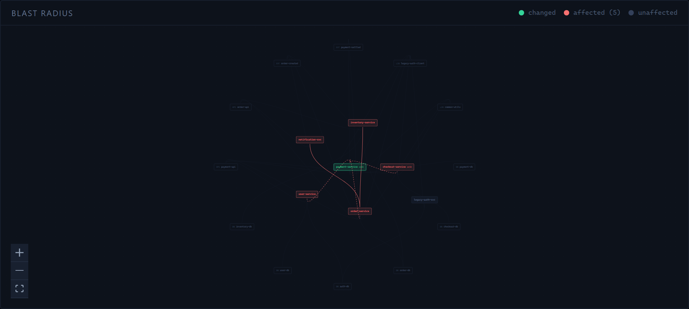

# 🛡️ ChangeGuardian AI


Describe a deployment in plain English and get back a 0–100 risk score, the blast
radius, the rules it violates, what happened last time someone tried it, and a
rollout strategy — before it reaches production.

**Features:** 7-agent LangGraph pipeline · **six of seven agents are fully
deterministic** — no model touches the score · live SSE stream showing each agent
as it completes · React Flow blast-radius graph · a full audit trail that
reconstructs the score factor by factor · hybrid retrieval (FAISS semantic search
**plus** a deterministic rule engine, deliberately not fused) · pluggable
inference across Groq, Gemini, or local Ollama · circuit breaker that degrades to
rule-based explanations instead of failing · shareable analysis links.



**Live demo:** _pending — `changeguardian.abishekrajavelu.in`_ ·
**API docs:** _`/docs` on the deployed instance_

## The score is never generated by a model

This is the design decision everything else follows from. A risk score that comes
out of an LLM cannot be audited, regression-tested, or defended in a change
review. Agent 6 is arithmetic, and every point it adds writes a matching line to
`risk_reasons`:



Those seven factors sum back to the score exactly — a test asserts it. The model's
job is narrower and honest: turn a finished analysis into prose.

The practical consequence is that a provider outage degrades wording, not
findings. **Running with no API key at all is a supported mode**, not a broken
one — all seven agents execute and agent 7 serves a deterministic explanation.

## Watch the pipeline run

`GET /api/analyze/stream` emits one server-sent event per agent, so the timeline
fills in live with each agent's actual intermediate output. The timings make the
architecture self-evident — the six deterministic agents finish in single-digit
milliseconds; only the model call costs anything:

<p align="center">
  
</p>

## Blast radius

NetworkX traversal in both directions — what this service depends on, and what
depends on it. The changed service sits at the centre, affected services in the
near ring, untouched services and infrastructure beyond:



## Tech Stack

| Layer | Technology |
| ----- | ---------- |
| Pipeline | Python 3.12, LangGraph, NetworkX |
| Retrieval | FAISS, fastembed (ONNX, `all-MiniLM-L6-v2`), deterministic rule engine |
| API | FastAPI, sse-starlette, slowapi, Pydantic |
| Inference | Any OpenAI-compatible endpoint — Groq `llama-3.1-8b-instant` by default |
| Frontend | React 19, Vite, TypeScript, Tailwind CSS 4, React Flow |
| Deployment | Single multi-stage Docker image (`linux/arm64`) on Dokploy behind Traefik |

## Repository Layout

```
Change-Guardian-AI/
├── backend/
│   ├── app/
│   │   ├── agents/     # the 7 agents, one module each
│   │   ├── llm/        # OpenAI-compatible client + circuit breaker
│   │   ├── rag/        # FAISS retrieval + rule engine
│   │   ├── graph/      # NetworkX service graph
│   │   ├── data/       # synthetic service inventory and incidents
│   │   └── api/        # routes, rate limiting
│   ├── scripts/        # index prebuild, LLM smoke test
│   └── tests/          # 30 tests, all offline
├── frontend/           # React + Vite SPA
├── docs/screenshots/
└── Dockerfile          # node build → python runtime
```

## Getting Started Locally

### Backend (port 8000)

Requires Python 3.12+.

```bash
pip install -r backend/requirements.txt
```

```bash
cp .env.example .env       # optional: add LLM_API_KEY for model explanations
```

```bash
uvicorn app.main:app --reload --app-dir backend
```

- API docs: http://localhost:8000/docs
- Health, including live circuit-breaker state: http://localhost:8000/health

Get a free Groq key at [console.groq.com/keys](https://console.groq.com/keys) —
no card required. Without one, the pipeline still runs end to end.

### Frontend (port 5173)

Requires Node 20+.

```bash
cd frontend && npm install && npm run dev
```

Vite proxies `/api` to the backend, so the frontend calls same-origin paths in
both dev and production.

### Everything at once

```bash
docker compose up --build
```

### Tests

```bash
python backend/tests/test_llm_client.py && python backend/tests/test_pipeline.py
```

30 tests, no network and no API key required. The pipeline suite pins the score
for all six scenarios, so a refactor that changes risk arithmetic fails loudly.

## API Summary

| Method | Path | Description | Status |
| ------ | ---- | ----------- | ------ |
| POST | `/api/analyze` | Run all 7 agents, return the report | 200 / 422 / 429 |
| GET | `/api/analyze/stream?change_request=` | SSE — one event per agent as it completes | 200 / 429 |
| GET | `/api/services` | Dependency graph as `{nodes, edges}` | 200 |
| GET | `/api/examples` | Canned requests, one per scenario | 200 |
| GET | `/health` | Status, LLM provider, circuit-breaker state | 200 |

`/health` returns 200 even when the LLM provider is down — provider state lives
in the body. Failing the healthcheck on an outage would restart a container that
is working correctly.

<details>
<summary>Report shape</summary>

```json
{
  "report": {
    "service": "payment-service",
    "scenario": "framework_upgrade",
    "risk_score": 100,
    "impact_level": "critical",
    "sla_impact": "CRITICAL SLA RISK",
    "financial_impact": 500000,
    "affected_services": ["checkout-service", "..."],
    "rule_violations": ["JAVA_MISMATCH: Spring Boot 3.2 requires Java >=17, ..."],
    "similar_incidents": [{ "id": "INC-002", "severity": "P1", "financial_impact": 500000 }],
    "memory_lessons": [{ "deployment": "DEP-101", "outcome": "success", "lessons": ["..."] }],
    "risk_reasons": ["Base score (+10)", "Service criticality=critical (+30)", "..."],
    "rollout_plan": "DEPLOYMENT BLOCKED - Resolve all violations before proceeding.",
    "llm_explanation": "...",
    "llm_remediation": ["...", "...", "..."],
    "llm_source": "llm"
  }
}
```

</details>

### Scenarios and thresholds

`framework_upgrade` · `resource_change` · `db_schema` · `api_contract` ·
`shared_dependency` · `event_schema`

≤25 **DIRECT** · 26–50 **CANARY** · 51–75 **STAGED** · >75 **BLOCKED**

## The dataset is synthetic

The seven services, six incidents, and five past deployments in
`backend/app/data/` are **invented** — modelled on a mid-size e-commerce estate,
not derived from any real system, and the financial figures are illustrative.
They exist to exercise the six scenarios, not to claim production provenance.

## Documentation

- [Architecture](ARCHITECTURE.md) — why six of seven agents avoid the model, hybrid retrieval, the circuit breaker
- [Deployment](DEPLOYMENT.md) — Dokploy + Traefik step-by-step, ARM constraints, rate-limit maths

## License

MIT — use it, fork it, learn from it.
